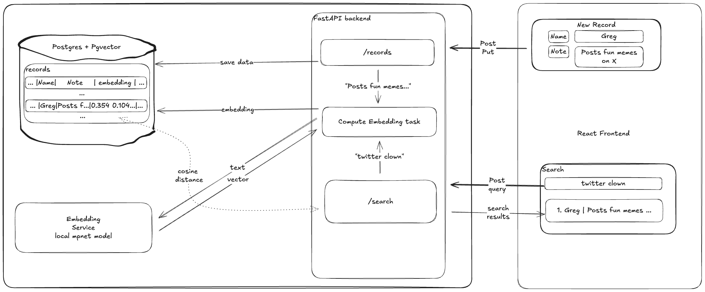

## Overview
PeoplePad is a semantic search app for remembering people you meet. 
Imagine meeting Greg, who posts funny memes on X, at a party. 
Next time you meet him, you vaguely remember what he does, but not his name

## Setup and run
- `docker compose up --build`
- Run migrations `docker compose exec backend alembic upgrade head`

## Architecture

